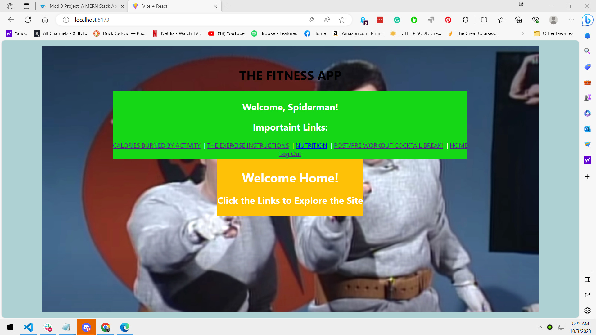

THE FITNESS APP:

Introduction: 
This is a fitness app that pulls data from 4 different API s in order to provide exercise information and nutrition information to fitness enthusiests. A breaktime cocktail recipe app is included for fun.

Trello: https://trello.com/b/ygHQpuY5

Technologies Used: APIs from the API ninjas collection (https://api-ninjas.com/); Vite; Mongodb/Mongoose; Axios; React.

Getting Started: Links to the project's planning (Trello board) and the deployed app.

Unsolved Problems: Currently functioning correctly. 

Future Enhancements: Would like to include a fitness diary section especially, which could imnpliment full crud functionality and make the need to log in and out apperant. I could also continue to bring in more APIs so that more fitness related data could be available to users. Finally, I would like to improve the presentation and styling. 
